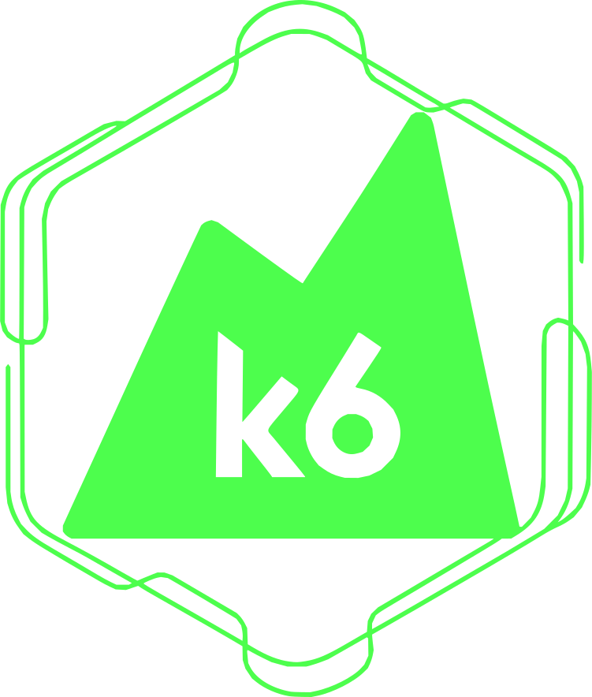

<p align="center">
  
</p>

<h3 align="center"> K6 for Nodejs </h3>

<p align="center"> CLI tool that enables k6 installation via npm packages
</p>

<p align="center">
<a href="https://k6.io/">
    
  </a>
  <a href="https://www.npmjs.com/package/k6-node">
    
  </a>
  <a href="https://www.npmjs.com/package/k6-node">
    
  </a>
  <a href="https://github.com/rodnye/k6-node/actions/workflows/publish.yml">
    
  </a>
</p>

## Overview

A CLI tool that solves a gap in the k6 ecosystem: **k6 currently doesn't support installation via npm packages**. This package enables you to define k6 as a dependency in your project and automatically handles the binary installation process.

## Related Documentation

- [k6 Official Documentation](https://k6.io/docs/)
- [k6 JavaScript API](https://k6.io/docs/javascript-api/)
- [k6 Installation Guide](https://k6.io/docs/getting-started/installation/)
- [k6 Testing Guides](https://k6.io/docs/testing-guides/)

## Features

- Downloads and installs the appropriate k6 binary for your platform. Works on Windows, Linux and MacOS
- Use k6 as a proper npm dependency in your projects
- Configure custom k6 binary paths via `.k6path` file

## Installation

```bash
npm install k6-node --save-dev
```

## Usage

Once installed, you can run k6 commands directly through the package:

```bash
npx k6-node run script.js
```

The tool will:

1. Check for a custom k6 binary path in `.k6path` file
2. Use an already installed binary if available
3. Automatically download and install k6 binary if not found
4. Execute your k6 command seamlessly

### Custom Binary Path

Create a `.k6path` file in your project root containing the path to your custom k6 binary:

```text
/path/to/your/custom/k6
```

## Project Integration

Add k6 as a development dependency in your `package.json`:

```json
{
  "devDependencies": {
    "k6-node": "^1.0.0"
  },
  "scripts": {
    "test:load": "k6-node run tests/load.js"
  }
}
```

## Future Development

**Note:** This is currently a CLI tool that will be extended to include programmatic methods for integration into larger testing frameworks and build processes.

## License

MIT
